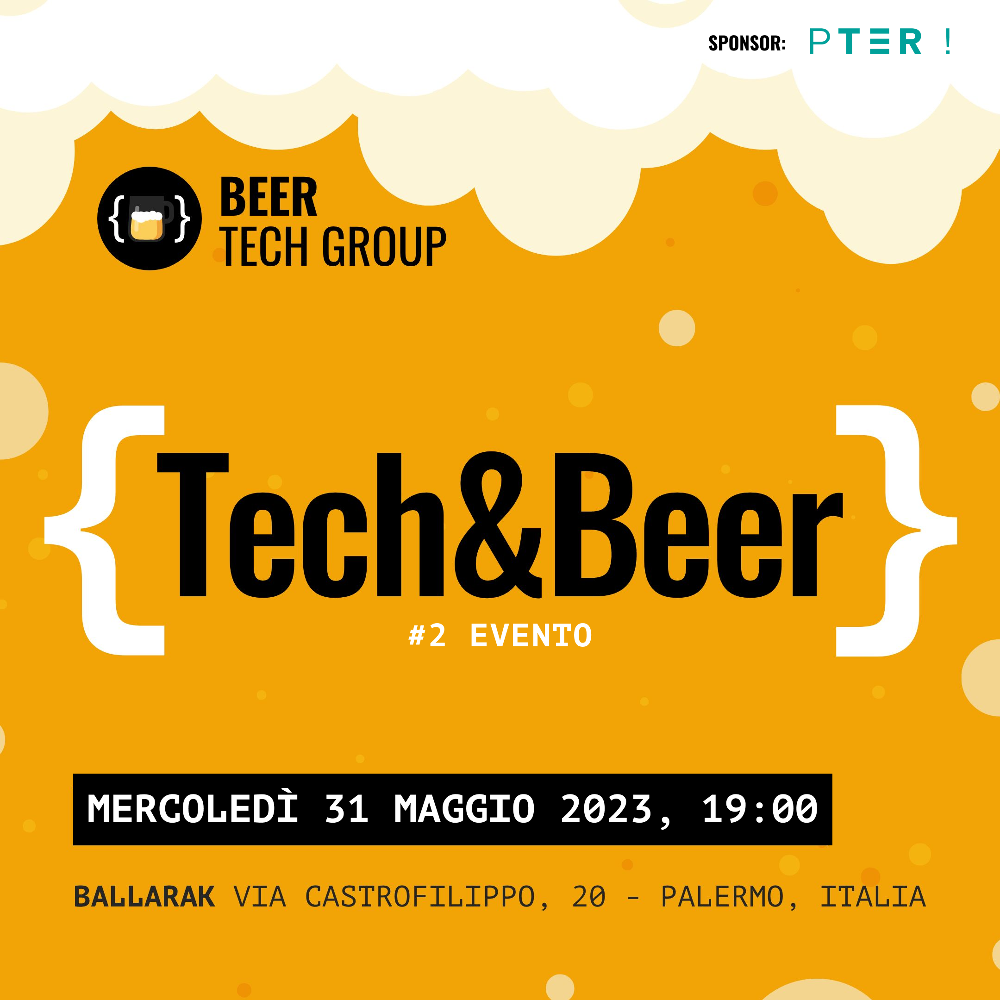

# Second Tech & Beer by Beer Tech Group! 🎉

## Event Informations

- __Date__: 31st may 2023
- __Location__: Ballarak Magione, Via Castrofilippo, 20 - Palermo, Italy
- __Event Type__: Tech & Beer, In person
- __Sponsor__: [PTER](https://pter.it)
- __Participants__: 45
- __Speakers__: 3
- __Agenda__:
  - 19:30 - 19:35 - Introduction
  - 19:35 - 19:40 - [Sponsor's Presentation (PTER)](#sponsors-presentation)
  - 19:40 - 20:10 - [KMM + Compose - Multiplatform love (Fausto Napoli)](#kmm--compose---multiplatform-love)
  - 20:10 - 20:40 - [Netlify: Deploying has never been easier (Gianluca La Manna)](#netlify-deploying-has-never-been-easier)
  - 20:40 - 21:10 - [Pest - Bring back the joy of testing in PHP (Claudio La Barbera)](#pest---bring-back-the-joy-of-testing-in-php)
  - 21:10 - Networking
- __Photos__: [https://beertechgroup.net/events/tech-and-beer-2/](https://beertechgroup.net/events/tech-and-beer-2/)

# Talks

## Sponsor's Presentation

- __Author__: PTER
- __Talk__: [PDF](/techandbeer_2/PTER.pdf)

## KMM + Compose - Multiplatform love

- __Author__: Fausto Napoli
- __Description__: From setup to run, enjoy the power of coding logic and UI once, and run on Android and iOS with great results. Enter Kotlin Multiplatform Mobile with an huge new companion: Compose Multiplatform!
- __Talk__: [PDF](/techandbeer_2/KMM%20+%20Compose_%20Multiplatform%20Love.pdf)

## Netlify: Deploying has never been easier

- __Author__: Gianluca La Manna
- __Description__: Have you ever wondered how could develop a website or a web application without having to worry about setting up complex servers or infrastructure? Can we give our customers the freedom to easily and securely deploy in a separate environment from production, without having to manage PR or push staging branches? Netlify makes this possible with its combination of continuous deployment, context deployment, and ease of use. In this talk we will discover together how Netlify works and how it can simplify our web development process.
- __Talk__: [PDF](/techandbeer_2/Netlify_%20Deploying%20has%20never%20been%20easier.pdf)

## Pest - Bring back the joy of testing in PHP

- __Author__: Claudio La Barbera
- __Description__: Discover the world of effortless and enjoyable testing with Pest, a new PHP Testing Framework that emphasizes simplicity. In this talk we will discover how testing becomes intuitive, user-friendly, and highly productive integrating Pest into a Laravel project.
- __Talk__: [PDF](/techandbeer_2/PEST_%20Bring%20back%20the%20joy%20of%20testing%20in%20PHP.pdf)
