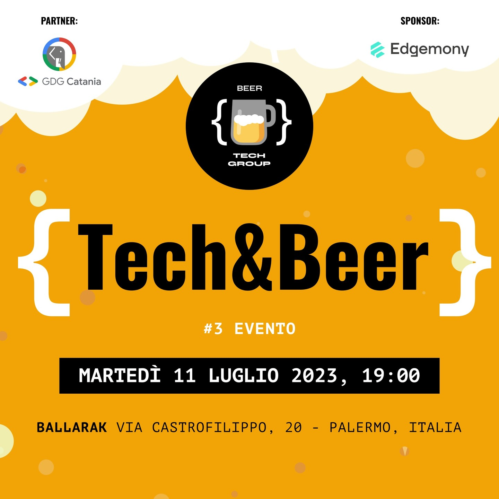

# Third Tech & Beer by Beer Tech Group! 🎉

## Event Informations

- __Date__: 11th july 2023
- __Location__: Ballarak Magione, Via Castrofilippo, 20 - Palermo, Italy
- __Event Type__: Tech & Beer, In person
- __Sponsor__: [Edgemony](https://edgemony.com)
- __Participants__: 45
- __Speakers__: 4
- __Agenda__:
  - 19:00 - 19:30 - Check-In & Introduction
  - 19:30 - 19:45 - Sponsor's Presentation (Edgemony)
  - 19:45 - 20:15 - [AI x Design Tokens (and More) (Federica Cutrera)](#ai-x-design-tokens-and-more)
  - 20:15 - 20:45 - [Lo straordinario mondo dei MakeFile (Francesco Bianco)](#lo-straordinario-mondo-dei-makefile)
  - 20:45 - 21:15 - [AMA Session (Fabio Biondi and Carlo Lucera)](#ama-session-fabio-biondi-and-carlo-lucera)
  - 21:15 - Networking
- __Photos__: [https://beertechgroup.net/events/tech-and-beer-3/](https://beertechgroup.net/events/tech-and-beer-3/)

# Talks

## AI x Design Tokens (and More)

- __Author__: Federica Cutrera
- __Description__: How Al can help design and handoff: examples and considerations.
- __Talk__: [PDF](/techandbeer_3/AI%20x%20Design%20Tokens%20(and%20more).pdf)

## Lo straordinario mondo dei MakeFile

- __Author__: Francesco Bianco
- __Description__: I Makefile sono stati e sono ancora uno strumento fondamentale per il mondo dello sviluppo software, si sono affermati come un punto di riferimento, soprattutto nell'ambito dell'Open Source. Inaspettatamente si prestano a risolvere problemi anche al di fuori dell'ambito in cui sono nati. Il mondo DevOps, ma anche lo sviluppo software Web non potranno fare a meno di beneficiare della potenza che un Makefile ben scritto ti può dare. Scopriamolo assieme partendo dalle basi.
- __Talk__: [PDF](/techandbeer_3/Il-Fantastico-Mondo-Dei-Makefile.pdf)

## AMA Session (Fabio Biondi and Carlo Lucera

- __Author__: Fabio Biondi & Carlo Lucera
- __Description__: AMA Session with Carlo Lucera (Hatdroid), Google Expert, Flutter expert always looking for new technological adventures as well as passionate about community and sharing, and Fabio Biondi, JavaScript/Angular guru, trainer, Microsoft MVP and Google Expert.
