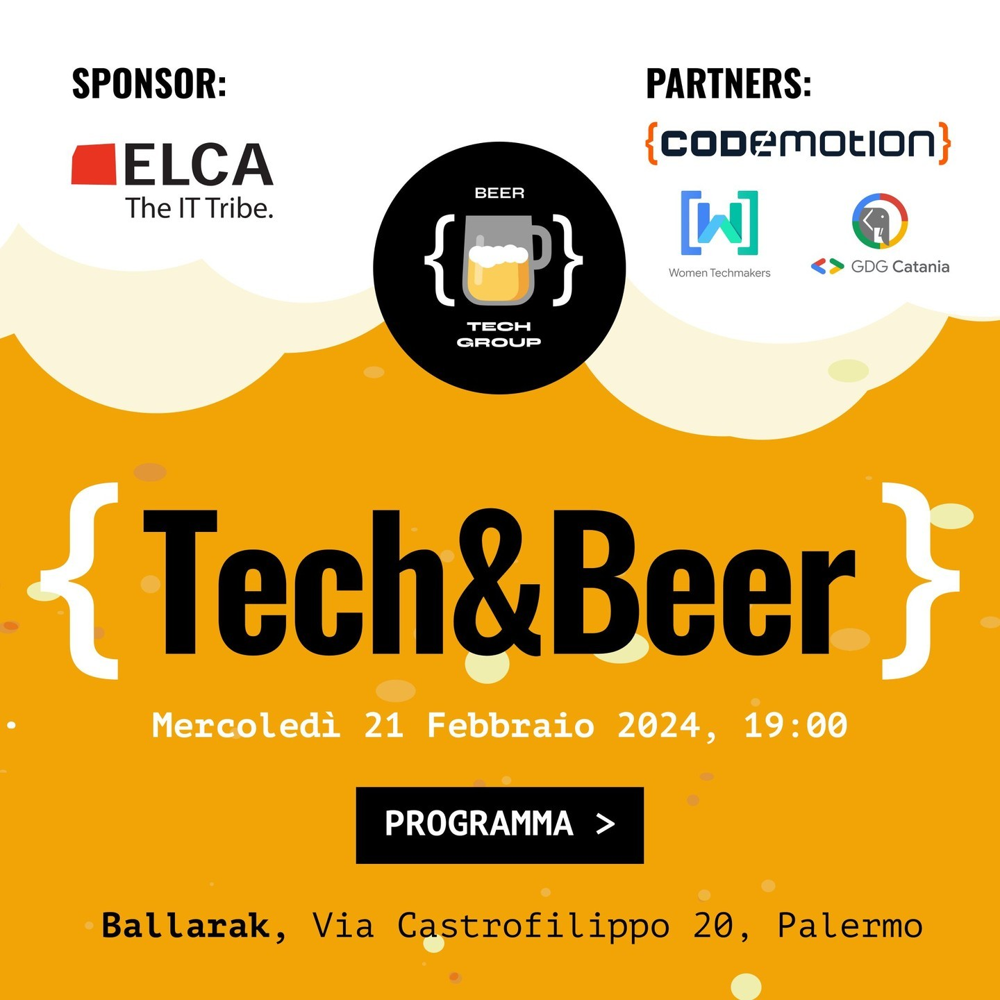

# Fifth Tech & Beer by Beer Tech Group! 🎉

## Event Informations

- __Date__: 21st february 2024
- __Location__: Ballarak Magione, Via Castrofilippo, 20 - Palermo, Italy
- __Event Type__: Tech & Beer, In person
- __Sponsor__: [ELCA](https://www.elca.ch)
- __Participants__: 45
- __Speakers__: 3
- __Agenda__: 
  - 19:00 - 19:30 - Check-in and Introduction
  - 19:30 - 19:45 - [Sponsor's Presentation (ELCA)](#sponsors-presentation)
  - 19:45 - 20:15 - [Cheshire Cat AI - Trasformando il Complesso in Semplice (Marco Valenti)](#cheshire-cat-ai---trasformando-il-complesso-in-semplice)
  - 20:15 - 20:45 - [Ship less code (Angular) (Davide Valenti)](#ship-less-code-angular)
  - 20:45 - 21:15 - [Password➡️Passkey - cosa sono e come funzionano i login passwordless? (Fabio Di Peri)]()
  - 21:15 - Networking
- __Photos__: [https://beertechgroup.net/events/tech-and-beer-5/](https://beertechgroup.net/events/tech-and-beer-5/)

# Talks

## Sponsor's Presentation

- __Author__: ELCA
- __Talk__: [PDF](/techandbeer_5/ELCA%20Shoring%20Italy%20Deck.pdf)

## Cheshire Cat AI - Trasformando il Complesso in Semplice

- __Author__: Marco Valenti
- __Description__: Scopriamo il Cheshire Cat (Stregatto), un framework Open Source 100% italiano per la messa in produzione di assistenti AI basati su Large Language Model
- __Talk__: 

## Ship less code (Angular)

- __Author__: Davide Valenti
- __Description__: 
- __Talk__: 

## Password➡️Passkey - cosa sono e come funzionano i login passwordless?

- __Author__: Fabio Di Peri
- __Description__: Sessione introduttiva ai login passwordless, accennando a tecniche più tradizionali come i magic link ma concentrandosi di più sugli standard moderni come FIDO2 e WebAuthn (di cui le passkey sono un'implementazione)
- __Talk__: 